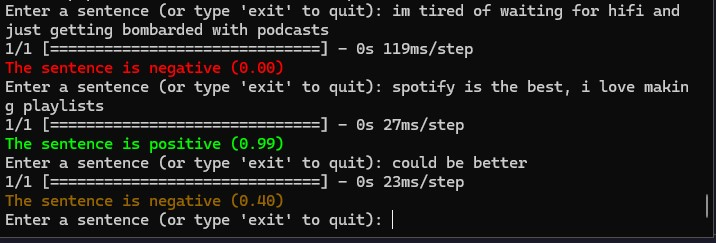
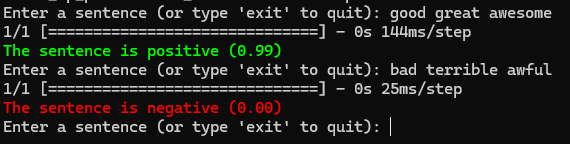

# spotify-reviews-sentiment-analysis

This project is going to be my first project related to NLP. My idea is to take a dataset with Spotify Reviews and perform a Sentiment Analysis on it from scratch, that is, my intention is to do it as little libraries as possible since the goal is not to get the best accuracy but rather to learn.

## Try it yourself

If you want to try the resulting model without having to train it, you can use the `try_it_yourself.py` that will load the model and let you input your own review to get the sentiment.

This is an example of the output you will get:

## Dataset

The dataset I am going to use is the [Spotify Reviews](https://www.kaggle.com/datasets/alexandrakim2201/spotify-dataset/data) dataset from Kaggle. It contains ~50k reviews with their respective label, positive or negative.

## Approach

You can find more detail in the notebook. But in summary:

### Preprocessing

First I removed duplicates and null values. Then I entered the text preprocessing phase.

1. **Replaced abbreviations** with their full form. Like "asap" to "as soon as possible". I did this using a dictionary with the most common abbreviations.
2. **Clean the text** by removing special characters, numbers, punctuation, and extra spaces. I also converted the text to lowercase. This was done using regular expressions.
3. **Tokenize**, simply used the `split()` method since the text was already clean.
4. **Remove stopwords** using the `nltk` stopwords list.
5. **Stemming**. Since I wanted to use as little libraries as possible, I implemented a simple stemming algorithm that removes certain suffixes from the words, like "ing", "ed", "ly", etc. It can be found in the notebook.

### Embeddings

#### Word to ID

The first approach that I took was to create a set with all the words from the training set and then assign an ID to each word. This way I could create a dictionary with the word as the key and the ID as the value.

If any word was missing from the set, I would assign the ID of the word `<OOV>` (Out Of Vocabulary).

And then to make all the reviews the same length, I would pad them with zeros or truncate them.

This approach yielded very poor results. This is, first of all, because we are giving an order to the words, so the model will learn that if for example "good" is ID 5481 and "bad" is ID 5482, then "good" and "bad" are close to each other. Which is not true.

Also, the order in which the words appear in the review mattered. Since I truncated the reviews to ~20 words, that means that there were ~20 input neurons. So maybe if a word appeared in the 4th position or in the 16th one, it would have a different weight since it would be connected to different neurons.

#### Bag of Words

After failing with the previous approach, I decided to use the Bag of Words model. This model is very simple, it just counts the number of times each word appears in the review and that's it.

To do this, I created a set with all the words from the training set and then created a dictionary with the word as the key and the number of times it appeared in the training set as the value. Then, to create the input for the model, I just created a list with the number of times each word appeared in the review.

This means that we have ~19.000 input neurons, one for each word in the set. But the order in which the words appear in the review doesn't matter anymore. What matters is the number of times each word appears.

This way, if a sentence contains a lot of positive words like "good", "great", "awesome", etc. the model will learn that that is a positive review, while if it contains a lot of negative words like "bad", "terrible", "awful", etc. it will learn that that is a negative review.

